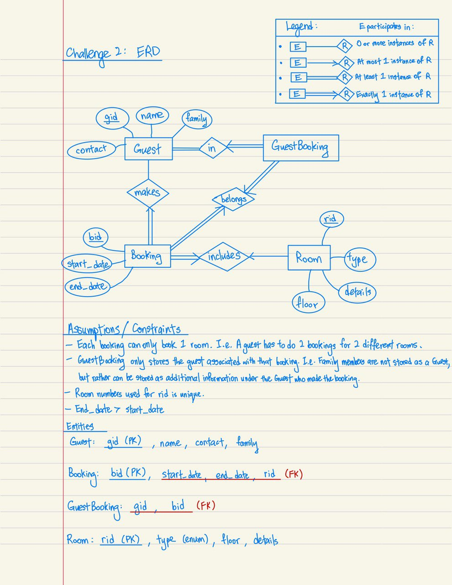

# GovTech Internship Tech Test
Take-home assignment for SWE Career Coach (CC4.0)

## Challenge 1
- Settled the main logic for the calculations
- Accepts input from `System.in` in CSV format
- Requires an additional `\n` newline input to terminate and return output of program

### Todo
- [x] Complete the bash script for auto-grading
- [x] Add unit testing
- [x] Complete the README instructions

## Challenge 2

